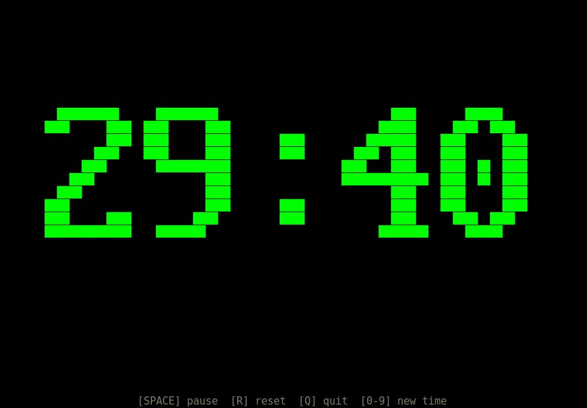

# countdown

A terminal countdown timer with large scaled bitmap
digits. Pure Rust, no dependencies.



## Usage

```
cargo run --release -- 30m
```

Duration formats: `30m`, `1h30m`, `90s`, `45`
(minutes). Default: `30m`.

Place `bell.wav` in the working directory to play a
sound when the timer finishes.

## Controls

| Key                              | Action         |
|----------------------------------|----------------|
| **Space**                        | Pause / resume |
| **R**                            | Reset          |
| **Q** / **X** / **Ctrl-C**      | Quit           |
| **0-9** (+ s/m/h) then **Enter**| New countdown  |
| **Backspace**                    | Edit input     |

## Display

Digits are rendered using a VGA16 bitmap font scaled
with Unicode half-block characters to fill the
terminal. The display rescales automatically on
window resize.

Color changes as time runs low: green, yellow, red,
then flashing when finished.

### Author

Jakob Kastelic
